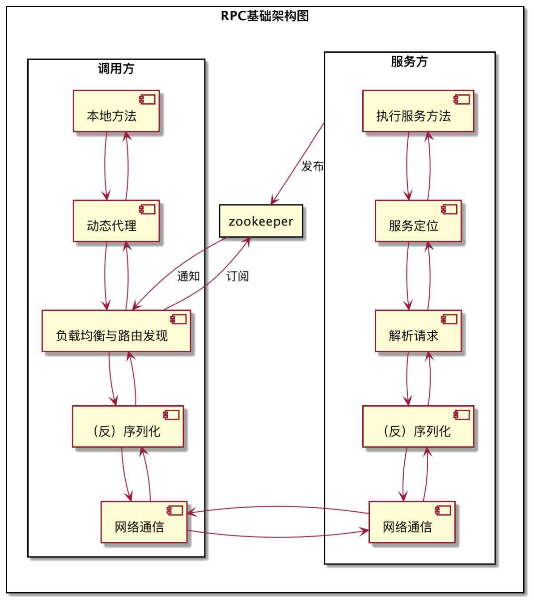

# 一、基础架构
## 1.1 RPC的基础结构

## 1.2 RPC的基本流程
- 客户端
    1. 客户端调用某个服务的本地存根方法时，实际上是使用动态代理生成的代理对象，在执行服务的方法时实际上执行的是*InvocationHandler*接口的invoke方法。
        - pigeon框架的*InvocationHandler*即为ServiceInvocationProxy
    2. 代理对象根据调用的信息去zk注册中心获得服务提供方的集群信息，通过负载均衡发现其中一个可用的服务提供方服务器地址
    3. 将请求信息序列化为二进制数据，通过netty的client将请求发送到服务提供方，同时wait服务的相应
- 服务端
    1. 将发布的服务注册到zk上，开启netty server监听器
    2. 收到客户端请求数据后，将数据反序列化为请求对象
    3. 解析请求，并进行必要的过滤操作
    4. 根据请求的信息定位到服务方唯一的服务
    5. 执行服务方法
    6. 将执行结果序列化为二进制数据，返回给客户端
## 1.3 pigeon主要组件
### 客户端组件
- `ReferenceBean/ProxyBeanFactory`: 获取服务**代理**对象。
    - `ReferenceBean`在init方法中通过`ServiceFactory.getService`方法初始化**代理**对象
    
    - `ReferenceBean`实现了`FactoryBean`接口
        - 当一个bean的class指定的是实现了`FactoryBean`接口的类时，则bean对应的是`FactoryBean.getObject()`方法返回的对象
- `InvokerBootStrap`: 完成客户端的一系列初始化操作
    - 服务调用仓库：`ServiceInvocationRepository.getInstance().init()`
    - 调用处理器工厂：`InvokerProcessHandlerFactory.init()`
    - 序列化工厂：`SerializerFactory.init()`
    - 负载均衡管理器：`LoadBalanceManager.init()`
    - 路由策略管理器：`RegionPolicyManager.INSTANCE.init()`
    - 监控器：`MonitorLoader.getMonitor().init()`
    - 响应处理器工厂：`ResponseProcessorFactory`
