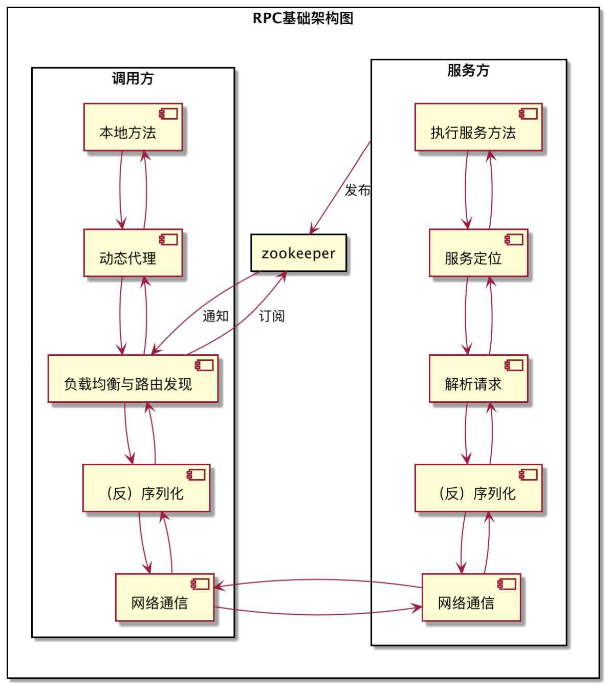

# 一、基础架构
## 1.1 RPC的基础结构

## 1.2 RPC的基本流程
- 客户端
    1. 客户端调用某个服务的本地存根方法时，实际上是使用动态代理生成的代理对象，在执行服务的方法时实际上执行的是*InvocationHandler*接口的invoke方法。
        - pigeon框架的*InvocationHandler*即为ServiceInvocationProxy
    2. 代理对象根据调用的信息去zk注册中心获得服务提供方的集群信息，通过负载均衡发现其中一个可用的服务提供方服务器地址
    3. 将请求信息序列化为二进制数据，通过netty的client将请求发送到服务提供方，同时wait服务的相应
- 服务端
    1. 将发布的服务注册到zk上，开启netty server监听器
    2. 收到客户端请求数据后，将数据反序列化为请求对象
    3. 解析请求，并进行必要的过滤操作
    4. 根据请求的信息定位到服务方唯一的服务
    5. 执行服务方法
    6. 将执行结果序列化为二进制数据，返回给客户端
## 1.3 pigeon主要组件
### 客户端组件
- `ReferenceBean/ProxyBeanFactory`: 获取服务**代理**对象。
    - `ReferenceBean`在init方法中通过`ServiceFactory.getService`方法初始化**代理**对象
    
    - `ReferenceBean`实现了`FactoryBean`接口
        - 当一个bean的class指定的是实现了`FactoryBean`接口的类时，则bean对应的是`FactoryBean.getObject()`方法返回的对象
- `InvokerBootStrap`: 完成客户端的一系列初始化操作
    - 服务调用仓库：`ServiceInvocationRepository.getInstance().init()`
    - 调用方处理器工厂：`InvokerProcessHandlerFactory.init()`
    - 序列化工厂：`SerializerFactory.init()`
    - 负载均衡管理器：`LoadBalanceManager.init()`
    - 路由策略管理器：`RegionPolicyManager.INSTANCE.init()`
    - 监控器：`MonitorLoader.getMonitor().init()`
    - 响应处理器工厂：`ResponseProcessorFactory`，初始化响应处理线程池`ResponseProcessThreadPool`
- `ServiceInvocationProxy`: pigeon的动态代理handler，实现`InvocationHandler`接口
    - 客户端每个动态生成的代理servcie调用服务方法时都会执行`ServiceInvocationProxy`的`invoke`方法，
      该方法会请求真正的远程服务，是**RPC实现的基础**
- `ServiceInvocationHandler`: 
    - 由InvokerProcessHandlerFactory生成
    - `ServiceInvocationProxy`的`invoke`方法中实际是调用`ServiceInvocationHandler`的`handle`方法来调用服务
    - `ServiceInvocationHandler`的`handle`方法实际上又是调用了`ServiceInvocationFilter`的`invoke`方法
- `ServiceInvocationFilter`: pigeon的rpc调用的过滤器，**实际上rpc的主要功能都是通过这些Filter实现的**，可以实现：
    1. mojitor监控
    2. 调用跟踪
    3. 服务降级
    4. 网关、上下分初始化/解析
    5. 安全控制
    6. 网络调用 等
    - `RemoteCallInvokerFilter`: 最后调用的是该filter，通过NettyClient的write方法将请求数据发送到远程服务器
        `RemoteCallInvokerFilter`提供四种调用方式（calltype）：
        - SYNC: 同步调用方式，客户端线程发送完数据阻塞等待结果返回，超时抛`TimeoutException`
        - FUTURE: 异步调用方式，客户端发送请求后立即返回不等待返回结果，存储返回结果的future对象会放入threadLocal中，
          当客户端需要返回结果时则到threadLocal中获取
        - CALLBACK: 回调的异步调用方式，客户端发送请求后立即返回不等待返回结果，但需要提供`InvocationCallback`接口回调对象给`ReferenceBean`，
          当结果返回时会将结果传递给回调对象处理
        - ONEWAY: 单向的异步调用方式，发送完请求立即返回，不关心处理结果，服务端也不会返回结果给客户端
- `NettyClient`: pigeon用netty实现的网络客户端，实现`Client`接口
    - 负责初始化`ClientBootstrap`，维护`ChannelPool`
    - 给服务提供方写入请求数据
- `HttpInvokerClient`: 实现了`Client`接口，负责http通信，监听4080端口
- `NettyClientHandler`: 绑定了ClientBootstrap的客户端ChannelHandler
    - 当服务提供方返回请求结果给客户端时接收数据，通过`ResponseProcessor`将相应数据放到`CallbackFuture`（存放结果的类）中
    - 当客户端获取response时，如果已经收到服务提供方响应的数据，则直接获取；
    - 否则await，直到收到响应数据，则notify获取响应数据的线程；
    - 超时则`throw TimeoutException`
### 服务端组件
- `ServiceBean/ServiceRegistry`: 服务方的入口
    - 实现了`ApplicationListener`，检测服务方的服务是否发布完成
    - 在`init`方法中完成服务的初始化和服务注册操作
        - 通过`ServerConfig`封装端口、线程池等配置信息
        - 通过`ProviderConfig`封装url、服务实现类、超时时间、`ServerConfig`等配置信息
        - 通过`ServiceFactory.addServices(providerConfigList)`注册服务
- `ProviderBootStrap`: 与`InvokerBootStrap`类似，完成服务端的一系列初始化操作
    - 初始化服务方处理器工厂、序列化工厂、注册管理器
    - 初始化JettyHttpServer监听4080端口
    - 初始化NettyServer
    - 初始化`RequestThreadPoolProcessor`的所有线程
- `ServicePublisher`: 将服务方的服务节点信息注册到zk注册中心，通过`RegistryManager`注册，实际上使用的是`CuratorRegistry`
- `NettyServer`: 用netty实现的网络服务端，实现了`Server`接口
    - 负责初始化`ServerBootstrap`
    - 监听tcp端口
- `JttyHttpServer`: 实现了`Server`接口，负责http通信，监听4080端口
- `NettyServerHandler`: 当客户端发起数据请求时，会接收数据
    - 如果是心跳检查，则直接处理并返回数据
    - 如果是真实请求，通过`RequestThreadPoolProcessor`来处理，找到服务调用最后返回数据
- `RequestThreadPoolProcessor`: 根据不同的`messageType`选择不同的`ServiceInvocationHandler`
    1. 业务处理handler
    2. 心跳处理handler
    3. 健康检查handler
    4. scanner心跳handler
    - 通过`ServiceInvocationHandler`和`ServiceInvocationFilter`处理请求数据，与客户端中一样，`Filter`其实是真正完成rpc功能的类
        - `BusinessProcessFilter`通过反射执行真正的服务方法
        - `WriteResponseProcessorFilter`回写处理完成的reponse数据给客户端，完成整个服务端处理请求的链路
